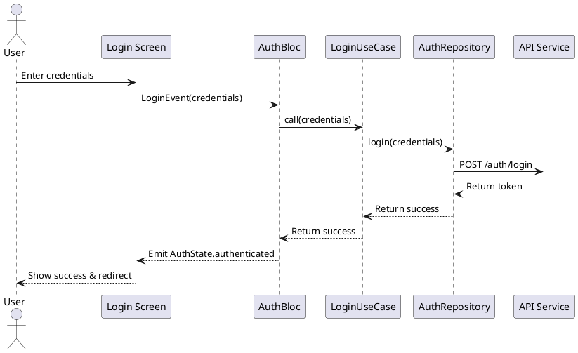
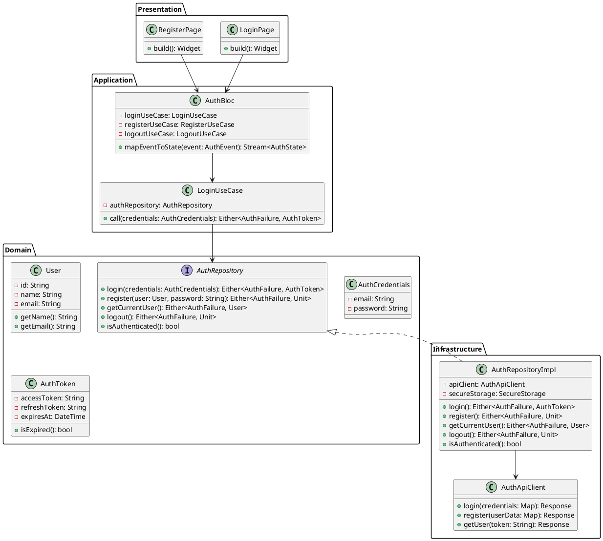
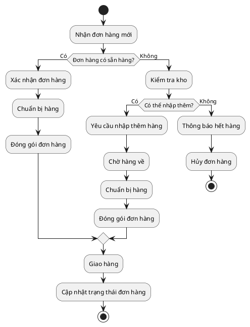
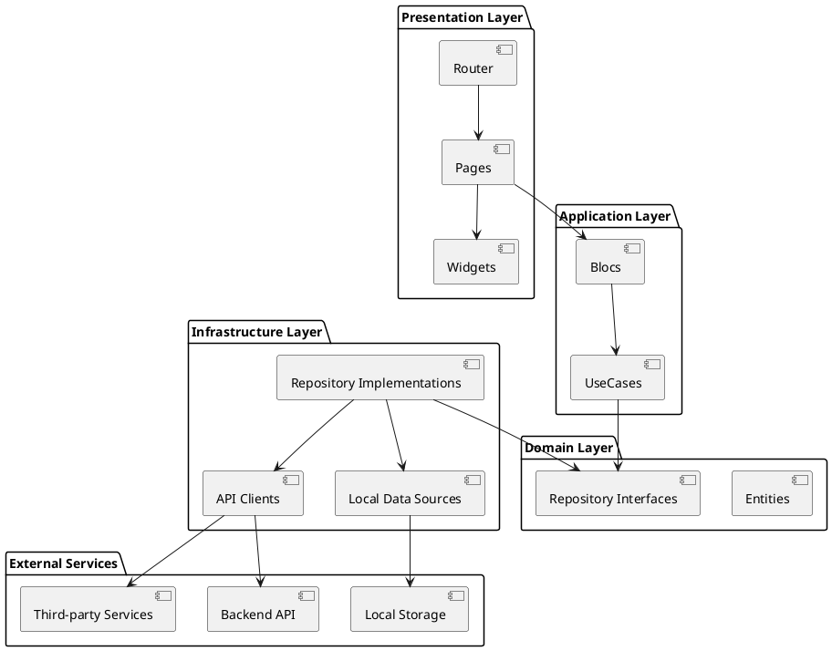
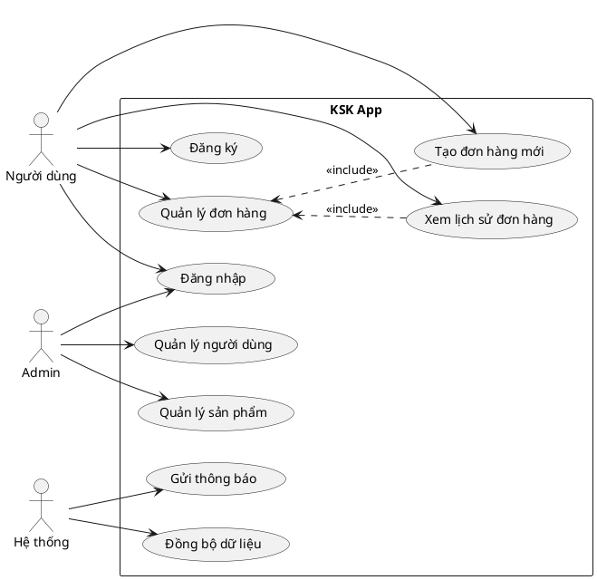
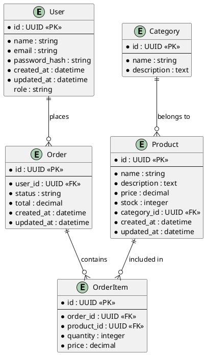
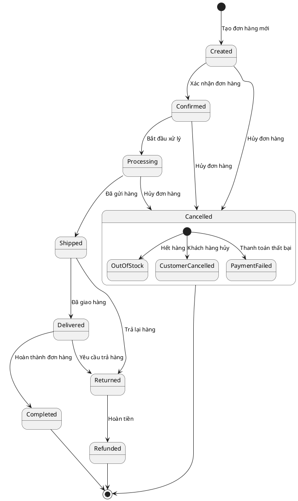
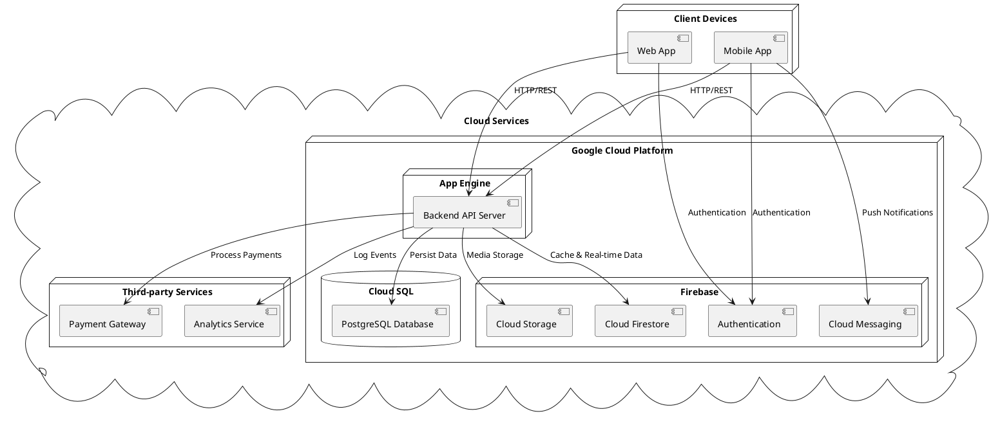

# UML Diagrams with PlantUML

Trang này chứa các ví dụ về sơ đồ UML được vẽ bằng PlantUML và được tích hợp vào Docusaurus.

## Sequence Diagram

Dưới đây là một ví dụ về biểu đồ tuần tự (sequence diagram) mô tả quy trình đăng nhập:

## Class Diagram

Dưới đây là ví dụ về biểu đồ lớp (class diagram) mô tả các thành phần chính trong module xác thực:

## Activity Diagram

Dưới đây là biểu đồ hoạt động (activity diagram) mô tả quy trình xử lý đơn hàng:

## Component Diagram

Dưới đây là biểu đồ thành phần (component diagram) mô tả kiến trúc ứng dụng:

## Use Case Diagram

Dưới đây là biểu đồ use case mô tả các chức năng chính của người dùng:

## ER Diagram

Dưới đây là biểu đồ thực thể quan hệ (ER Diagram) mô tả cơ sở dữ liệu:

## State Diagram

Dưới đây là biểu đồ trạng thái (state diagram) mô tả vòng đời của một đơn hàng:

## Deployment Diagram

Dưới đây là biểu đồ triển khai (deployment diagram) mô tả kiến trúc hệ thống:

Những ví dụ trên minh họa cách bạn có thể dùng PlantUML để vẽ các loại biểu đồ UML khác nhau trong tài liệu Docusaurus của mình. 