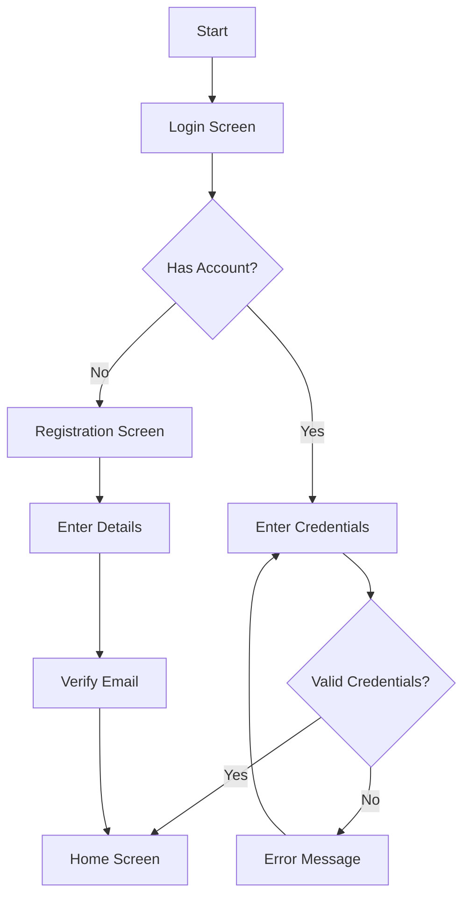

# Figma Analysis for Requirements Extraction

## Role: Business Analyst / UI/UX Designer

As a Business Analyst and UI/UX Designer, your responsibility is to analyze Figma designs and user requirements to create comprehensive Software Requirements Specifications (SRS). You'll extract functional and non-functional requirements, identify user stories, and document assumptions and open questions.

## Figma Analysis Tasks

### 1. Initial Figma Review

When presented with a Figma design file or project requirements, follow this systematic approach:

```
1. Review the entire Figma file to understand the overall scope
2. Identify all screens and user flows
3. Note design patterns, components, and interaction models
4. Document the information architecture
5. Identify potential edge cases and error states
```

### 🧾 Output Format & Export Instruction

All extracted requirements should be exported in the following format:

- Output: Markdown file (`.md`)
- Folder path: `/docs/requirements/[feature_name].md`
- Naming: Use kebab-case for filenames (e.g., `login-requirements.md`)
- If using Cursor toolchain: trigger `cursor.export('srs')` to export automatically

### 2. Extract Functional Requirements

Analyze the Figma designs to identify functional requirements using this format:

```markdown
# Functional Requirements

## User Stories

### Authentication
- As a user, I want to create an account so that I can access the application
- As a user, I want to log in with my credentials so that I can access my account
- As a user, I want to reset my password so that I can regain access if I forget it

### [Feature Name]
- As a [user type], I want to [action] so that [benefit]
- As a [user type], I want to [action] so that [benefit]
- As a [user type], I want to [action] so that [benefit]

> 💡 Tip: For each requirement, assign a MoSCoW priority label (Must, Should, Could, Won't) to indicate importance.

Example:
- [MUST] The system shall allow user login with email and password
- [SHOULD] The system should support Google social login

## Feature Requirements

### Authentication
1. The system shall provide user registration with email and password
2. The system shall validate email format during registration
3. The system shall enforce password complexity requirements
4. The system shall provide password reset functionality via email

### [Feature Name]
1. The system shall [requirement]
2. The system shall [requirement]
3. The system shall [requirement]
```

### 3. Extract Non-Functional Requirements

Document non-functional requirements that are implied by the design:

```markdown
# Non-Functional Requirements

## Performance
- The application should load initial screen within 2 seconds
- All user interactions should respond within 0.5 seconds
- API calls should complete within 3 seconds

## Usability
- The application should be usable on both mobile and tablet devices
- The application should follow accessibility guidelines (WCAG 2.1 AA)
- The application should provide clear error messages for all error states

## Security
- User passwords must be stored securely using bcrypt
- All API communications must use HTTPS
- Session tokens should expire after 30 minutes of inactivity

## Scalability
- The system should support up to 10,000 concurrent users
- The database should handle up to 1 million records without performance degradation

## Reliability
- The application should have 99.9% uptime
- The system should recover gracefully from network failures
```

### 4. Document Assumptions and Constraints

Identify and document assumptions and constraints:

```markdown
# Assumptions and Constraints

## Assumptions
- Users have stable internet connectivity
- Users are familiar with standard mobile application patterns
- The application will initially support English language only
- Users will primarily access the application via mobile devices

## Constraints
- The application must be developed within 3 months
- The application must work on iOS 14+ and Android 8+
- The application must comply with GDPR regulations
- The application must use the existing backend API
```

### 5. Identify Open Questions

Document questions that need clarification:

```markdown
# Open Questions

1. How should the system handle offline mode?
2. What are the specific password complexity requirements?
3. Are there any third-party integrations required?
4. What analytics should be implemented?
5. How should user data be handled for GDPR compliance?

## 6.1 Pending Confirmations (To Validate with Stakeholders)

- [ ] Is offline mode required?
- [ ] Is multi-language support expected?
- [ ] Will users register only with email or also social providers?
- [ ] What analytics tools are expected (Firebase, Amplitude...)?
- [ ] Is biometric login required?
```

### 6. Create User Flow Diagrams

Document the user flows identified in the Figma designs:

```markdown
# User Flows

## Authentication Flow


> 🧠 Create separate user flow diagrams for each feature group: Authentication, Booking, Profile, Notifications, etc.

## SRS Document Template

Compile all the extracted information into a comprehensive SRS document:

```markdown
# Software Requirements Specification

## 1. Introduction
### 1.1 Purpose
[Describe the purpose of the application]

### 1.2 Scope
[Define the scope of the application]

### 1.3 Definitions, Acronyms, and Abbreviations
[List any terms, acronyms, or abbreviations used in the document]

## 2. Overall Description
### 2.1 Product Perspective
[Describe how the product fits into the larger ecosystem]

### 2.2 User Classes and Characteristics
[Describe the different types of users and their characteristics]

### 2.3 Operating Environment
[Describe the environment in which the application will operate]

### 2.4 Design and Implementation Constraints
[List any constraints that will impact development]

### 2.5 Assumptions and Dependencies
[List assumptions and dependencies]

## 3. Functional Requirements
### 3.1 User Stories
[List user stories by feature]

### 3.2 Feature Requirements
[List detailed requirements by feature]

## 4. Non-Functional Requirements
### 4.1 Performance
[List performance requirements]

### 4.2 Usability
[List usability requirements]

### 4.3 Security
[List security requirements]

### 4.4 Scalability
[List scalability requirements]

### 4.5 Reliability
[List reliability requirements]

## 5. User Interfaces
### 5.1 Screen Descriptions
[Describe each screen in the application]

### 5.2 User Flows
[Document user flows with diagrams]

## 6. Open Questions
[List questions that need clarification]

## 7. Appendices
### 7.1 Figma Design References
[Include links to Figma designs]

### 7.2 API Documentation
[Include references to API documentation]
```

## Chain of Thought Analysis

When analyzing complex requirements, use the Chain of Thought approach:

1. **Initial Observation**: "I see a screen with a form that has email and password fields, along with login and registration buttons."

2. **Inference**: "This appears to be an authentication screen that handles both login and registration."

3. **Requirement Extraction**: "From this screen, I can extract several requirements:
   - The system must allow users to log in with email and password
   - The system must allow new users to register
   - The system should validate email format
   - The system should have password requirements"

4. **User Story Creation**: "These requirements can be formulated as user stories:
   - As a user, I want to log in with my email and password so that I can access my account
   - As a new user, I want to create an account so that I can use the application"

5. **Edge Case Consideration**: "I should also consider edge cases:
   - What happens if a user forgets their password?
   - What happens if a user enters incorrect credentials?
   - Is there a limit to login attempts?"

6. **Non-Functional Requirements**: "The design also implies non-functional requirements:
   - The login process should be secure
   - The interface should be responsive
   - Error messages should be clear and helpful"

> 📌 Chain-of-thought insights should be compiled into structured checklist or table when possible for easier review and automation.

## Explanation

This cursor rule guides the analysis of Figma designs to extract comprehensive requirements for Flutter application development. It:

1. Provides a structured approach to analyzing Figma designs
2. Helps extract functional requirements in the form of user stories and system requirements
3. Identifies non-functional requirements that might be implied by the design
4. Documents assumptions, constraints, and open questions
5. Creates user flow diagrams to visualize interactions
6. Compiles all information into a comprehensive SRS document

It also recommends structured export format and provides stakeholder confirmation prompts. The rule ensures that all requirements are properly documented before development begins, reducing the risk of misunderstandings and scope creep. It also helps identify potential issues early in the development process.

## Alternative Approaches

1. **User-Centered Design Approach**: Focus more on user personas and scenarios rather than system requirements. This approach puts more emphasis on user needs and experiences but might miss technical requirements.

2. **Agile User Story Mapping**: Use a user story mapping approach to organize requirements by user activities and priorities. This is more visual and can help with sprint planning but might be less comprehensive for technical details.

3. **Jobs-to-be-Done Framework**: Analyze requirements based on the jobs users are trying to accomplish rather than features. This focuses more on user outcomes but might be harder to translate directly into technical requirements.

4. **Domain-Driven Design Approach**: Analyze requirements from a domain model perspective, focusing on the business domain and its rules. This aligns well with DDD implementation but might be more complex for simple applications.
