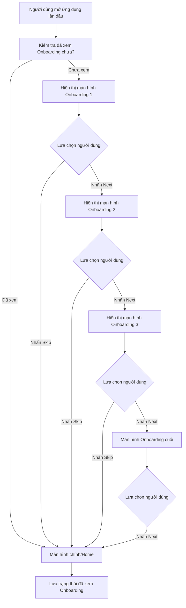

# Phân Tích Sâu Về Ảnh Màn Hình & Hướng Dẫn Viết Tài Liệu SRS Bằng Tiếng Việt

Dưới đây là ví dụ minh họa cách phân tích một màn hình Onboarding (từ ảnh screenshot "EIGA Cinema UI Kit") và cách trích xuất yêu cầu phần mềm (Software Requirements Specification - SRS) tương ứng. Toàn bộ nội dung được trình bày bằng tiếng Việt.

---

## 1. Giới Thiệu Chung

### 1.1 Mục Đích
Màn hình Onboarding trong ảnh là bước giới thiệu ban đầu khi người dùng lần đầu mở ứng dụng. Nó cung cấp một tóm tắt nhanh về chức năng chính của ứng dụng: "Chọn phim, xem trailer, đặt vé...". Việc phân tích giúp ta hiểu rõ hơn về:
- Trải nghiệm người dùng (UX) ngay từ khi khởi động.
- Tính năng cần thiết (ví dụ: nút "Next", nút "Skip") và cách chúng vận hành.
- Cách thức giới thiệu nhanh các lợi ích chính của ứng dụng.

### 1.2 Phạm Vi
Phạm vi phân tích ở đây tập trung vào:
- Màn hình Onboarding đầu tiên của ứng dụng xem phim/trailer và đặt vé (Cinema Booking).
- Các hành vi người dùng tại bước Onboarding (chuyển trang, bỏ qua...).
- Yêu cầu chức năng (Functional) và phi chức năng (Non-Functional) liên quan đến Onboarding.

### 1.3 Thuật Ngữ, Từ Viết Tắt
- **Onboarding**: Quá trình giới thiệu tóm tắt về ứng dụng khi người dùng lần đầu truy cập.
- **UI Kit**: Bộ giao diện người dùng (User Interface) giúp thiết kế nhanh theo phong cách nhất quán.
- **CTA (Call-to-Action)**: Các nút hành động chính như "Next" hoặc "Skip".

---

## 2. Mô Tả Tổng Quan

### 2.1 Tổng Quan Sản Phẩm
Ứng dụng "EIGA Cinema UI Kit" là một giải pháp xem thông tin phim, trailer và đặt vé xem phim trên điện thoại di động. Màn hình Onboarding nhằm:
- Trình bày lợi ích cốt lõi ("Chọn phim, xem trailer, mua vé").
- Thu hút người dùng tiếp tục tìm hiểu và đăng ký/đăng nhập vào ứng dụng.
- Cho phép người dùng bỏ qua (Skip) hoặc tiếp tục (Next) để xem các màn hình giới thiệu tiếp theo.

### 2.2 Loại Người Dùng & Đặc Điểm
1. **Người dùng mới**: Lần đầu cài đặt, cần hướng dẫn tổng quan.
2. **Người dùng quen thuộc**: Có thể nhấn "Skip" để bỏ qua bước giới thiệu.

### 2.3 Môi Trường Vận Hành
- Ứng dụng mobile, iOS 14+ hoặc Android 8+.
- Màn hình kích thước khoảng 5 - 6.7 inch (smartphone), hỗ trợ cả tablet (có thể mở rộng).

### 2.4 Ràng Buộc Thiết Kế & Triển Khai
- Thời gian phát triển tính năng Onboarding nằm trong deadline 3 tháng của dự án.
- Phải giữ giao diện tối giản, rõ ràng, nhất quán với thương hiệu (EIGA).

### 2.5 Giả Định & Phụ Thuộc
- Người dùng có kết nối internet ổn định.
- Người dùng đã quen với việc dùng ứng dụng di động (các thao tác cơ bản).
- Có sẵn backend/API để đồng bộ thông tin phim & trailer.

---

## 3. Yêu Cầu Chức Năng (Functional Requirements)

### 3.1 User Stories
- **Là người dùng mới**, tôi muốn xem nhanh những lợi ích ứng dụng mang lại để quyết định sử dụng.
- **Là người dùng**, tôi muốn có tùy chọn **Skip** để bỏ qua phần giới thiệu và vào thẳng trang chính.
- **Là người dùng**, tôi muốn nhấn **Next** để xem các màn hình Onboarding tiếp theo (nếu có nhiều slide).

#### Mức Độ Ưu Tiên (MoSCoW)
- **[MUST]** Ứng dụng phải có ít nhất một màn hình Onboarding giới thiệu các tính năng chính.
- **[SHOULD]** Người dùng nên có tùy chọn "Skip" để bỏ qua giới thiệu.
- **[COULD]** Có thể hiển thị hình ảnh động hoặc hiệu ứng để nâng cao trải nghiệm.
- **[WON'T]** Tạm thời không yêu cầu nhập thông tin cá nhân ngay trên màn hình Onboarding.

### 3.2 Yêu Cầu Chức Năng Cụ Thể
1. **Chức năng hiển thị Onboarding**
   - Ứng dụng phải hiển thị màn hình Onboarding khi người dùng cài đặt và mở lần đầu.
   - Màn hình chứa nội dung giới thiệu (icon camera, mô tả ngắn gọn...).

2. **Chức năng chuyển tiếp màn hình (Next)**
   - Khi bấm nút "Next", người dùng được chuyển sang màn hình Onboarding tiếp theo (nếu có).
   - Nếu đây là bước cuối cùng, bấm "Next" sẽ chuyển đến màn hình chính (Home).

3. **Chức năng bỏ qua (Skip)**
   - Khi bấm "Skip", người dùng sẽ được chuyển ngay sang màn hình chính (Home).
   - Hệ thống phải ghi lại trạng thái đã bỏ qua để không hiển thị Onboarding lần sau.

4. **Chức năng theo dõi đã xem Onboarding**
   - Ứng dụng cần lưu cờ (flag) trong bộ nhớ cục bộ (hoặc server) để biết người dùng đã xem Onboarding chưa.
   - Nếu người dùng quay lại ứng dụng, không hiển thị Onboarding lại.

---

## 4. Yêu Cầu Phi Chức Năng (Non-Functional Requirements)

### 4.1 Hiệu Năng (Performance)
- Màn hình Onboarding phải tải trong vòng **2 giây** trên mạng 4G tiêu chuẩn.
- Các nút bấm (Next, Skip) phản hồi trong **0.5 giây**.

### 4.2 Khả Năng Sử Dụng (Usability)
- Giao diện tối giản, trực quan, chữ dễ đọc, nút bấm nổi bật.
- Tuân theo các nguyên tắc **WCAG 2.1 AA** (màu sắc, độ tương phản).

### 4.3 Bảo Mật (Security)
- Mặc dù Onboarding không yêu cầu đăng nhập, nhưng toàn bộ giao tiếp API (nếu có) phải qua HTTPS.
- Không thu thập dữ liệu cá nhân trên màn hình Onboarding.

### 4.4 Khả Năng Mở Rộng (Scalability)
- Hỗ trợ thêm nhiều slide Onboarding khi có nhu cầu giới thiệu tính năng mới.
- Cho phép cập nhật nội dung Onboarding từ server mà không cần phát hành lại ứng dụng (nếu tích hợp CMS).

### 4.5 Độ Tin Cậy (Reliability)
- Hệ thống phải vẫn cho phép người dùng truy cập ứng dụng bình thường kể cả khi phần nội dung Onboarding không tải được (hiển thị nội dung mặc định).

---

## 5. Giao Diện Người Dùng (UI/UX)

### 5.1 Mô Tả Màn Hình Onboarding
- **Logo**: Hiển thị ở phía trên, bao gồm icon hình tam giác "EIGA" và dòng chữ "Cinema UI Kit".
- **Hình minh họa**: Biểu tượng máy quay phim (camera) nằm trong vòng tròn, xung quanh có các vòng tròn nhỏ trang trí.
- **Tiêu đề Onboarding**: "ONBOARDING" (hoặc nội dung giới thiệu).
- **Mô tả ngắn**: "Choose movies, watch trailers, take tickets."
- **Thanh chỉ thị (Indicator)**: 3-4 chấm phía dưới để biểu thị có nhiều slide.
- **Nút 'NEXT'**: Màu xanh dương, nổi bật, dùng để chuyển sang bước sau hoặc tới màn hình chính (nếu là bước cuối).
- **Nút 'SKIP'**: Văn bản đơn giản nằm phía dưới, cho phép bỏ qua toàn bộ quy trình Onboarding.

### 5.2 Lưu Đồ Người Dùng (User Flow)

